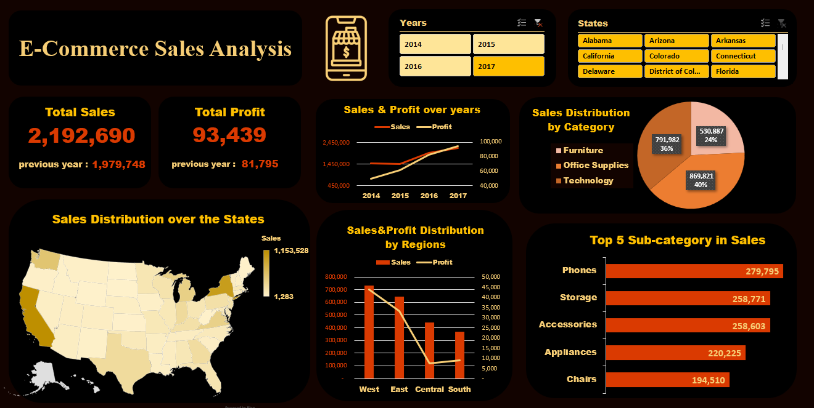

# E-Commerce 2014~2017 Sales Analysis
  

## Table of Contents
- [E-Commerce 2014~2017 Sales Analysis](#e-commerce-2014~2017-sales-analysis)
  - [Table of Contents](#table-of-contents)
  - [Collection](#collection)
  - [Cleaning](#cleaning)
  - [Analysis](#analysis)
  - [Insights of 2017](#Insights-of-2017)
  - [Thank you](#thank-you)

## Collection
- Combine all raw data and sheets (4 tables total) into 1 file named **`RAW_Sales_Dataset`**.

---

## Cleaning  
1. Removed **1 duplicate row**.  
2. Confirmed **no nulls** in the entire dataset.  
3. Corrected the **`order_date`** datatype.  
4. Transformed **`ship_date`** into 3 columns and merged them into a valid date datatype.  
5. Verified **no outliers** in the following fields:  **`Country`**  & **`State`**  & **`Region`**  & **`Category`**  and **`Subcategory`**  
6. Ensured **`sales`** contains **no zeros or negative numbers**.  
7. Added a calculated column:  
   **`total_revenue = (sales * discount if discount > 0) * quantity`**  
8. Split **country** and **city** using a delimiter.  
9. For **`people`** and **`returns`** tables:  
   - Used the first row as headers.  
10. Created relationships between tables in **Power Pivot**.  

---

## Analysis  
1. **Total sales vs. total sales previous year** – *KPI*  
2. **Total profit vs. total profit previous year** – *KPI*  
3. **Sales vs. Profit over the years** – *line chart*  
4. **Sales Distribution by States** – *map*  
5. **Sales & Profit Distribution by Regions** – *clustered bar chart* or *radar*  
6. **Sales Distribution by Category** – *vertical bar chart*  
7. **Top 10 Sub-category by Sales** – *horizontal bar chart*  

---

## Insights of 2017  
1. **Sales Growth**:  
   - Total sales increased to **\$2,192,690** (current year) from **\$1,979,748** (previous year), reflecting **~10.7% growth**.  

2. **Profit Growth**:  
   - Total profit rose to **\$93,439** (current year) from **\$84,795** (previous year), a **10.2% increase** (original text noted "-10.2%", likely a typo).  

3. **Category Dominance**:  
   - **Accessories** accounted for **36% of sales** (total **\$869,821**). Other categories include Furniture, Office Supplies, and Technology.  

4. **Top Sub-Categories**:  
   - **Appliances** led with **\$220,225** in sales, followed by **Storage**.  

5. **Data Trends (2014–2017)**:  
   - Sales and profit likely grew year-over-year (exact values unclear due to formatting).  

6. **Profit Margins**:  
   - Profit ratios vary significantly by region (e.g., **6.25% in West** vs. unclear in other regions).

---

## Thank you 
